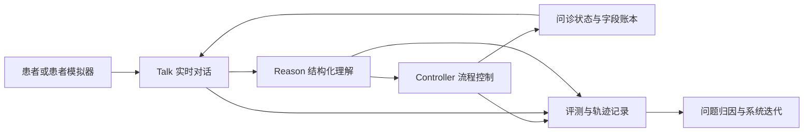
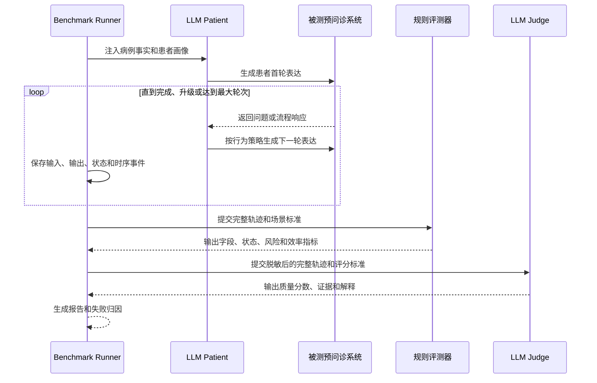
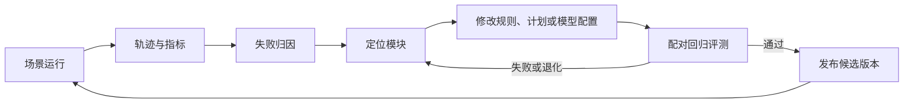

## 摘要

预问诊系统的目标不是简单地与患者聊天，也不是让大模型根据一段提示词自由生成问题，而是在正式就诊前，以自然、低延迟且可控的方式，完成关键信息采集、风险识别、信息确认和问诊摘要。

在真实业务场景中，预问诊同时面临三类挑战：一是问诊路径包含大量领域规则，单纯依赖提示词难以稳定约束；二是小参数模型响应快但长对话能力和复杂规则理解能力有限，大参数模型能力更强却带来更高成本和首字延迟；三是缺少面向预问诊全过程的通用评测方法，难以判断系统究竟是“表达不够自然”，还是“漏采集信息、错误理解、路径失控或风险处理失败”。

为解决上述问题，我们提出预问诊 Harness，一种由实时 Talk、结构化 Reason 和流程 Controller 协同组成的智能体框架。框架使用小参数模型承担面向患者的实时对话，使用大参数模型或专用推理模块处理复杂的信息抽取、状态更新和问诊规则判断，再由显式流程控制器决定下一步动作，从而在响应速度、模型能力和业务可控性之间取得平衡。

在此基础上，我们进一步提出一套面向预问诊的交互式评测框架。该框架通过可配置的患者画像和患者行为策略模拟真实问诊过程，并通过对外接口接入其他预问诊模型或系统，使用规则评测与 LLM as a Judge 相结合的方式，对信息覆盖、理解准确性、问诊路径、风险识别、总结质量、对话效率和终止行为进行评估。评测结果、完整对话轨迹和结构化状态变化还可以反向驱动系统迭代，使 Harness 具备面向业务规则的持续进化能力。

> 本框架用于预问诊系统的工程评测、回归验证和能力迭代，不替代临床诊断，也不应直接作为医疗安全有效性的最终证明。

## 1. 背景与问题

### 1.1 预问诊不是开放式聊天

传统的对话式大模型通常以“理解用户问题并生成回答”为主要目标，而预问诊系统需要在有限轮次内完成一项有明确边界的任务：围绕当前就诊目的采集必要信息，并按照业务规则推进流程。

患者的表达往往不是结构化的。患者可能在一次回答中同时提供多个信息，也可能只回答部分问题、主动补充尚未询问的症状、偏离当前话题、拒绝回答、表示不确定，或修改之前的回答。因此，系统必须持续回答以下问题：

- 患者刚才提供了哪些事实？
- 哪些信息已经获得，哪些只是被询问但尚未回答？
- 患者是否表达了否定、不确定、拒绝或纠正？
- 当前是否出现需要优先处理的风险信号？
- 下一步应该追问哪个字段，还是应该进入总结、确认或转人工流程？
- 在信息不完整时，何时应该停止追问？

这说明预问诊的核心不是“生成一段听起来合理的话”，而是让语言生成、信息理解和流程决策形成稳定的闭环。

### 1.2 单纯依赖提示词的局限

如果将所有问诊规则、字段定义、追问顺序、异常处理和终止条件都写入提示词，系统会面临几个问题：

1. **规则与语言生成耦合**：模型既要理解复杂的业务规则，又要生成自然的患者话术，任务负担过重。
2. **长对话状态不稳定**：随着对话变长，模型可能遗漏之前已经收集的信息，重复提问，或者错误地理解历史上下文。
3. **规则执行不可验证**：即使提示词中写明了“发现风险信号后立即升级”，也很难仅凭最终文本确认模型是否真正执行了该规则。
4. **异常路径容易发散**：面对拒答、矛盾回答、跑题和主动补充等情况，模型可能偏离预设问诊路径。
5. **业务变更成本高**：增加一个字段、调整一个风险规则或修改一个终止条件，往往需要反复修改提示词并重新验证整个系统。

提示词仍然是模型能力配置的重要组成部分，但它不应承担全部的流程控制职责。需要将可验证的业务规则、会话状态和模型生成能力拆开管理。

### 1.3 单一模型难以同时满足质量与实时性

使用小参数模型可以降低调用成本和首字延迟，适合承担实时对话和简单话术生成，但在长对话、隐含信息、多字段抽取和复杂规则判断方面可能不够稳定。

使用大参数模型可以提升复杂推理和边界场景处理能力，但通常意味着更高的调用成本、更长的响应延迟，以及更高的并发资源压力。若每一轮对话都调用大模型，系统很难满足实时预问诊的交互体验。

因此，一个更合理的方案是让不同模型承担不同职责：实时路径使用低延迟模型，复杂判断使用更强的推理模型或异步模块，流程安全边界由确定性的 Controller 负责。

### 1.4 缺少通用的预问诊评测方式

预问诊系统的质量不能只通过 BLEU、ROUGE、单轮问答准确率或人工主观感受来衡量。一个回答语言流畅的系统，仍然可能存在以下严重问题：

- 遗漏主诉、起病时间、持续时间等关键字段；
- 将患者的否定表达理解成阳性症状；
- 没有识别患者主动补充的信息；
- 在已经获得答案后重复提问；
- 患者出现风险信号后仍继续常规问诊；
- 患者拒绝回答后无限追问；
- 总结内容与患者原始表达不一致；
- 没有经过患者确认就直接结束问诊；
- 对话轮次过长、成本过高或首字延迟过高。

这些问题必须放在完整的交互轨迹中进行评估，而不是只看某一轮输出。

## 2. 核心思路

预问诊 Harness 的核心思想是：

> 用低延迟模型负责“怎么和患者说”，用高能力模型负责“患者说了什么、状态如何变化”，用显式控制器负责“接下来允许做什么”。

框架将一次问诊拆分为四个相互协作但职责清晰的环节：

1. **Talk**：根据当前问诊计划生成面向患者的自然语言回复。
2. **Reason**：从患者完整表达中抽取结构化字段、识别否定与不确定性、发现风险信号，并处理信息冲突。
3. **Control**：依据结构化状态、问诊模板和业务规则决定下一步动作。
4. **Evaluate**：通过模拟患者和评测器对完整轨迹进行自动化评估，并定位失败原因。

其中 Talk 和 Reason 可以使用不同规模、不同延迟特征的模型；Control 尽量采用可解释、可验证的显式逻辑；Evaluate 则作为独立于被测系统的外部能力存在。

## 3. 预问诊 Harness 总体架构



### 3.1 Talk：低延迟的患者交互层

Talk 面向患者，负责把当前的问诊计划转换为简洁、自然、易理解的表达。它不需要自行推断完整的问诊路径，而是接收 Controller 提供的结构化 `InterviewPlan`，例如：

- 当前动作：提问、澄清、总结、确认、风险提示或结束；
- 当前目标字段；
- 本轮问题目标；
- 已经收集的信息；
- 尚未完成的字段；
- 可使用的患者事实；
- 当前动作的约束条件。

Talk 的主要约束包括：

- 每轮尽量只围绕一个主要问题推进；
- 先回应或承接患者最新表达，再提出下一步问题；
- 不进行未经授权的诊断和治疗建议；
- 不把系统推断当作患者事实；
- 总结阶段只总结已获得信息，并请求患者确认；
- 风险阶段停止常规字段采集，按照规则输出明确的分流或升级提示。

Talk 适合使用小参数、低延迟模型，也可以通过流式输出和语音链路降低用户感知延迟。

### 3.2 Reason：结构化信息理解层

Reason 负责将患者的自然语言表达还原为可供系统控制的结构化状态。它需要扫描患者完整的一轮表达，而不能只关注上一轮被询问的字段，因为患者可能在一句话中回答多个问题，或主动补充其他重要信息。

每个字段可以维护以下状态信息：

- 字段 ID；
- 原始值与标准化值；
- 当前状态；
- 置信度；
- 支撑该结论的原文证据；
- 首次出现和最近更新时间；
- 是否需要再次确认；
- 是否由患者主动纠正。

建议区分以下状态：

- `unknown`：尚未获得信息；
- `asked`：已经询问，但患者尚未有效回答；
- `answered`：患者已经提供回答；
- `confirmed`：患者已确认系统总结或结构化结果；
- `skipped`：依据规则跳过；
- `refused`：患者明确拒绝回答。

Reason 还需要显式标记否定、不确定、拒绝、部分回答和纠正。例如，“没有发热”不能被记录成“发热”；“不太确定，大概三天”不能被当成完全确定的时间；“刚才说错了，是左侧”应当替换此前的部位信息，并保留纠正证据。

### 3.3 Controller：显式流程控制层

Controller 是系统可控性的核心。它不负责生成长篇自然语言，而是根据当前状态和问诊规则，决定允许系统执行的下一步动作。

Controller 的职责包括：

- 选择下一个待采集字段；
- 判断字段是否适用于当前就诊类型；
- 防止重复提问；
- 控制单个字段的最大追问次数；
- 处理字段冲突和患者纠正；
- 优先处理风险信号；
- 在信息足够时进入总结；
- 在总结后等待患者确认；
- 在达到最大轮次时强制收束；
- 处理患者主动结束、拒答和转人工等情况。

一个典型的状态流转如下：

```text
active
  -> ready_to_summarize
  -> awaiting_confirmation
  -> completed
```

风险信号可以从 `active` 直接进入 `escalated`；患者主动终止可以进入 `abandoned`。将 `summarize` 与 `finish` 分成两个动作非常重要：系统不能在生成总结后未经患者确认就直接宣称问诊完成。

### 3.4 状态账本与事件轨迹

Harness 不只保存最终回复，还保存每一轮问诊的完整事件轨迹，包括：

- 患者原始输入和系统输出；
- Talk 使用的问诊计划；
- Reason 输出的字段更新；
- Controller 执行的状态迁移；
- 风险标记及其证据；
- 模型名称、版本、提示词版本和参数；
- 请求时间、首字延迟、完整响应延迟和 token 使用量；
- 错误、取消、重试和超时事件。

完整轨迹使系统能够区分语言表达问题、信息理解问题、流程控制问题、异步状态问题和模型服务问题，也为后续回放、回归测试和问题归因提供基础。

## 4. 双模型协同与实时性设计

### 4.1 模型职责分工

| 模块 | 主要职责 | 典型模型选择 | 实时性要求 |
| --- | --- | --- | --- |
| Talk | 生成患者可理解的提问、承接、总结和提示 | 小参数模型 | 高 |
| Reason | 多字段抽取、否定识别、冲突处理、风险理解 | 大参数模型或专用推理模型 | 中，可异步 |
| Controller | 状态迁移、规则执行、终止和升级 | 确定性逻辑为主 | 高 |
| Judge | 对完整轨迹进行质量判断和解释 | 大参数评测模型 | 低，不在用户主链路 |

### 4.2 实时路径与复杂路径分离

用户可感知的响应由 Talk 负责，优先保证首字延迟和对话连贯性。Reason 可以在后台并行处理当前患者输入，并将结构化结果写入状态账本。下一轮 Talk 使用带版本号的问诊计划，避免读取过期状态。

当 Talk 和 Reason 之间存在短暂时序差异时，系统需要记录：

- 计划版本；
- 状态版本；
- 事件 ID；
- 生成开始时间和完成时间；
- 使用该计划时 Reason 是否已经完成。

这样可以识别“旧计划导致的错误”，而不是将所有问题都归因于语言模型能力不足。

### 4.3 成本与延迟收益

该架构的预期收益包括：

- 大模型不必参与每一轮面向患者的文本生成；
- 低延迟模型可以快速开始输出，改善首字延迟；
- 复杂理解任务集中在必要场景中执行；
- Judge 在离线评测阶段运行，不影响在线问诊体验；
- Controller 负责硬约束，减少通过重复提示词维持规则的成本。

实际收益应通过统一实验记录进行验证，至少比较首字延迟、完整响应延迟、单次问诊成本、模型调用次数、字段覆盖率和风险处理准确率。

## 5. 面向预问诊的交互式评测框架

### 5.1 评测目标

评测对象可以是 Harness 自身，也可以是任何能够通过对外接口进行交互的预问诊系统。评测不依赖系统内部实现，只观察系统输入输出和可选的标准化事件接口，因此能够支持不同模型、不同厂商和不同部署形态的横向比较。

评测的最小单位不是一组静态问答，而是一个可执行的患者场景。一个场景包含：

- 病例事实及其标准答案；
- 患者画像，如年龄、表达习惯、健康素养和情绪状态；
- 患者行为策略，如主动补充、跑题、拒答、不确定和纠正；
- 本场景要验证的系统能力；
- 预期的可观察行为；
- 确定性评分规则和 LLM Judge 评分维度；
- 最大问诊轮次、终止条件和风险处理要求。

同一病例事实可以通过不同语言表达和行为策略生成多条交互轨迹，从而减少对固定参考答案的依赖。

### 5.2 LLM as a Patient

患者模拟器由两层组成：

1. **行为策略层**：决定本轮透露哪些事实、是否回答当前问题、是否主动补充、是否拒绝或纠正。
2. **语言实现层**：将行为策略实现为符合患者画像的自然语言表达。

可配置的患者行为包括：

- 正常回答当前问题；
- 一次回答多个字段；
- 主动补充尚未询问的信息；
- 只回答问题的一部分；
- 跑题或表达不清；
- 表示“不知道”或拒绝回答；
- 修改此前的回答；
- 对同一事实进行矛盾表达；
- 在关键风险信号出现时使用隐晦或非标准表达。

被测系统只能看到患者可见的对话内容，不能看到患者隐藏事实、行为策略、测试分类和评分规则，避免评测泄漏。

### 5.3 LLM as a Judge

LLM Judge 适合评估难以完全用规则表达的质量维度，例如：

- 是否真正理解了患者意图；
- 问题是否清晰、自然且适合患者理解；
- 是否在上下文中合理承接了上一轮表达；
- 总结是否忠实、完整、无过度推断；
- 风险提示是否清楚、及时且符合场景要求；
- 是否出现机械重复、无效追问或不必要的对话延长。

为降低 Judge 的主观性，应要求其输出评分、证据片段、判定理由和置信度，并优先引用实际对话轨迹。涉及字段是否采集、状态是否迁移、是否超过最大轮次等可验证事实，则应由确定性评测器完成。

### 5.4 规则评测与模型评测结合

| 评测维度 | 推荐评测方式 | 示例指标 |
| --- | --- | --- |
| 字段覆盖 | 规则评测 | 必填字段覆盖率、风险字段覆盖率 |
| 信息理解 | 规则 + 证据校验 | 多字段识别率、否定准确率、纠正处理率 |
| 流程执行 | 规则评测 | 重复提问率、非法状态迁移率、终止合规率 |
| 风险处理 | 规则优先，Judge 辅助 | 风险召回率、升级及时性、误升级率 |
| 对话质量 | LLM Judge + 人工抽检 | 承接性、清晰度、自然度、克制性 |
| 总结质量 | 规则 + LLM Judge | 忠实度、完整度、患者确认率 |
| 效率与成本 | 运行时统计 | 轮次、首字延迟、总延迟、token、单次成本 |

最终结果不应只汇总成一个分数。应同时输出各维度得分、关键失败案例和安全相关的硬性门槛。对于风险识别失败、事实幻觉和未经确认的错误总结等问题，即使总体平均分较高，也应单独标记为阻断性缺陷。

## 6. 评测执行流程



一次完整评测应包括：

1. 加载版本化场景和患者画像；
2. 启动患者模拟器与被测系统；
3. 通过统一接口逐轮交互；
4. 记录所有可观测事件和运行元数据；
5. 在达到完成、升级、主动结束或最大轮次后停止；
6. 执行规则评测；
7. 执行 LLM Judge 评测；
8. 聚合指标并生成失败案例报告；
9. 与基线版本进行配对比较。

## 7. 自进化闭环

评测框架的价值不止是给系统打分，更重要的是把失败转化为可执行的改进任务。



### 7.1 失败归因

每个失败案例应尽量定位到具体环节：

- **Talk 生成问题**：问题表达不清、重复提问、承接不自然或越权给出诊断；
- **Reason 理解问题**：漏抽取、多字段漏记、否定识别错误、证据不足或冲突处理错误；
- **Controller 控制问题**：选择了错误字段、没有优先风险、没有遵守最大追问次数或错误结束；
- **状态同步问题**：Talk 使用了过期计划，或异步结果覆盖了更新后的状态；
- **场景与规则问题**：测试场景不清晰、标准答案存在歧义或评分器判断不稳定。

### 7.2 单模块迭代

为避免一次修改多个变量导致无法判断改进来源，建议采用单模块迭代协议：

- 固定病例场景、患者行为种子和评测配置；
- 每次只修改一个模块、规则集或模型配置；
- 使用相同场景执行基线版本和候选版本；
- 比较质量、安全、延迟和成本指标；
- 检查候选版本是否在其他场景上发生退化；
- 保存版本、轨迹、评分和决策理由。

例如，针对“患者在一句话中提供多个字段但系统只记录一个”的问题，应优先修改 Reason 的结构化抽取或状态合并逻辑，并通过同一组场景验证，而不是同时修改 Talk 提示词、问诊顺序和评分规则。

### 7.3 业务规则进化

当新增业务规则时，可以将规则转化为三类资产：

1. **运行规则**：Controller 在在线问诊时执行的状态与路径约束；
2. **测试场景**：能够触发该规则的患者画像、事实和行为策略；
3. **评测标准**：判断规则是否被正确执行的确定性检查和 Judge 维度。

这样，业务规则不再只是散落在提示词中的文字，而是同时具备运行、验证和回归能力。新规则上线前可以先在离线场景中验证，避免直接影响真实患者流程。

## 8. 框架的主要贡献

### 8.1 面向业务规则的智能体架构

我们将实时对话、复杂推理和流程控制拆分为不同模块，使系统可以根据任务特点选择不同规模的模型，并通过显式状态和规则提升可控性。

### 8.2 面向完整轨迹的预问诊评测方法

我们将评测单位从单轮问答提升为完整交互场景，覆盖信息采集、理解、路径推进、风险处理、总结确认和结束行为，能够发现传统文本相似度指标无法识别的问题。

### 8.3 可接入外部系统的统一评测接口

被测系统不需要采用 Harness 的内部架构，只要实现统一的会话交互接口，就可以接入患者模拟器和评测流水线。这使得不同预问诊模型或系统能够在相同场景和指标下进行对比。

### 8.4 评测驱动的持续进化机制

通过完整轨迹、结构化状态、版本化配置和失败归因，评测结果可以直接转化为规则、提示词、模型配置或代码层面的改进，并通过配对回归验证改进是否真实有效。

## 9. 边界与后续工作

当前框架首先解决的是预问诊系统的工程可控性和迭代效率，仍需在以下方向继续完善：

- 引入临床专家参与场景设计、指标定义和结果复核；
- 使用脱敏真实对话验证患者模拟与真实患者行为之间的差异；
- 研究不同患者模拟模型、随机种子和语言风格对评测稳定性的影响；
- 对 LLM Judge 进行校准，报告其与人工评测的一致性；
- 建立高风险错误的硬性阻断规则和人工复核机制；
- 增加多轮语音场景下的打断、延迟、识别错误和噪声评测；
- 研究跨专科、跨语言和不同健康素养患者的泛化能力；
- 通过线上灰度和真实业务反馈验证离线分数与实际体验的相关性。

特别需要强调的是，模拟患者可以有效支撑早期开发、回归测试和边界场景覆盖，但不能完全替代真实患者、临床专家和受监管环境下的正式验证。

## 10. 总结

预问诊系统的关键难点不在于让大模型生成更多问题，而在于让系统在真实、不完整、具有歧义的患者表达中，持续维护正确状态并稳定执行问诊规则。

预问诊 Harness 通过 Talk、Reason 和 Controller 的职责分离，将低延迟交互、复杂信息理解和业务流程控制组合起来，降低了单一大模型承担全部任务带来的延迟、成本和发散风险。同时，基于 LLM as a Patient 和 LLM as a Judge 的交互式评测框架，为预问诊系统提供了从场景构造、完整运行、自动评分到失败归因的统一方法。

更重要的是，评测不再是系统开发完成后的终点，而是成为 Harness 的反馈回路：新的业务规则可以转化为新的运行约束、测试场景和评测标准，系统则可以通过可重复的回归实验持续改进。这使预问诊系统从依赖提示词的开放式生成，逐步演进为可配置、可观测、可评测和可持续进化的智能体系统。


